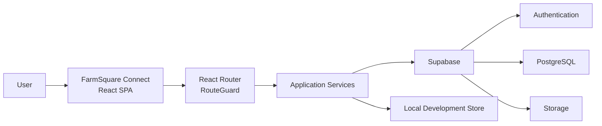

# FarmSquare Connect

FarmSquare Connect is an agricultural marketplace web application that connects Farmers, Buyers, Agents, and Admins through role-based marketplace workflows for listings, orders, KYC, and wallet-related workflows.

## Overview

FarmSquare provides a single-page web interface where Farmers can list produce and Buyers can discover and order listings. Agents and Admins have separate interfaces for inspections, moderation, and operational workflows.

The frontend is a TypeScript React application built with Vite. Authentication, persistence, and media storage use Supabase (Auth, PostgreSQL, and Storage). A local development fallback is also available to run the UI without a Supabase backend.

## Problem

Regional agricultural markets often require manual coordination for listing produce, discovering prices, verifying identity, and completing payout workflows.

FarmSquare streamlines these processes into a unified, role-driven interface so each user type can access the tools and workflows relevant to them within a single application.

## Solution

FarmSquare provides:

- Role-specific dashboards and protected routes for Farmers, Buyers, Agents, and Admins.
- Listing creation and management for Farmers.
- A marketplace interface for Buyers to discover agricultural products.
- Order lifecycle management.
- Wallet-oriented workflows for balances, transactions, and payout requests.
- KYC workflows that gate certain actions, such as withdrawal requests.
- Admin and Agent interfaces for moderation, inspections, logistics, and dispute workflows.

## User Roles

### Farmer

Farmers can create and manage product listings, monitor orders, access market information, manage their profiles, complete KYC workflows, and interact with wallet-related features.

### Buyer

Buyers can browse the marketplace, inspect listing details, manage orders, access reports, maintain their profiles, and interact with wallet-related workflows.

### Agent

Agents have access to operational workflows including farmer management, inspections, deliveries, reports, and profile management.

### Admin

Admins have broader management interfaces covering users, listings, KYC reviews, orders, payments, logistics, disputes, reports, and media management.

## Key Features

- Public-facing marketing and informational pages.
- Email/phone authentication and session management through Supabase Auth.
- Local authentication fallback for development.
- Role-based client routing and protected pages.
- Farmer product listing creation and management.
- Buyer marketplace and product discovery.
- Order management workflows.
- KYC verification workflows.
- Market price intelligence displayed within the Farmer dashboard.
- Wallet, transaction, and payout-request workflows.
- Administrative interfaces for users, listings, KYC, payments, disputes, and logistics.
- Agent workflows for inspections and deliveries.
- Listing photo support.
- Media management using Supabase Storage.
- Server-state fetching and caching with React Query.
- Lazy-loaded application routes.

> **Note:** FarmSquare's wallet functionality represents application-level wallet, transaction, and payout-request workflows. It does not itself provide banking infrastructure or external payment rails.

## Architecture

FarmSquare is structured as a client-side React application backed primarily by Supabase.

The frontend handles the user interface, routing, role-specific experiences, and application interactions. A service layer encapsulates authentication, profiles, orders, wallets, and other data operations.

Supabase provides authentication, PostgreSQL persistence, and media storage.

### Core Architecture

- **Frontend:** React + TypeScript + Vite
- **Routing:** React Router
- **Authentication:** Supabase Auth
- **Database:** PostgreSQL through Supabase
- **Storage:** Supabase Storage
- **Data Layer:** Application services under `src/services/`
- **Authentication State:** `AuthProvider`
- **Client Route Protection:** `RouteGuard`
- **Server State:** React Query
- **Deployment:** Vercel



### Application Services

The `src/services/` layer contains application operations and data-access logic, including services for:

- Authentication
- User profiles
- Orders
- Wallet workflows
- Local development authentication

This keeps data-access concerns separate from the application's UI components.

## Tech Stack

### Frontend

- React
- TypeScript
- Vite
- Tailwind CSS
- shadcn/ui
- Radix UI primitives
- React Router

### Data Fetching & State

- React Query
- React Context

### Backend & Platform

- Supabase
- Supabase Auth
- Supabase Storage

### Database

- PostgreSQL

### Deployment

- Vercel

## Project Structure

The main application structure is organized as follows:

```text
farmsquare-connect/
├── src/
│   ├── pages/
│   ├── components/
│   ├── services/
│   ├── contexts/
│   ├── lib/
│   ├── App.tsx
│   └── main.tsx
│
├── public/
├── supabase/
├── README.md
├── package.json
├── vite.config.ts
├── vercel.json
└── .env.example
```

### `src/pages/`

Contains route-level pages organized around public and role-specific application experiences, including Farmer, Buyer, Agent, and Admin interfaces.

### `src/components/`

Contains reusable UI components, layouts, authentication components, route protection, cards, modals, and other shared interface elements.

### `src/services/`

Contains the application's service and data-access layer, including authentication, profile, order, wallet, and local development services.

### `src/contexts/`

Contains React context providers, including the authentication context used throughout the application.

### `src/lib/`

Contains shared application utilities, including Supabase client configuration and local development storage utilities.

### `supabase/`

Contains Supabase-related database, migration, function, and storage setup resources used by the project.

## Authentication & Authorization

FarmSquare uses an authentication abstraction that allows the application to work with Supabase authentication while retaining a local development fallback.

### Authentication Flow

The application authentication service delegates authentication operations to Supabase when the required Supabase configuration is available.

The Supabase authentication service handles operations including:

- Sign up
- Sign in
- Sign out
- Session retrieval

Following authentication, application-level records such as the user's profile and wallet can be initialized through their respective services.

### AuthProvider

`src/contexts/AuthContext.tsx` centralizes authentication state for the React application.

Its responsibilities include:

- Restoring authentication sessions.
- Listening for authentication state changes.
- Providing the current authenticated user to the application.
- Exposing authentication operations to components.

### RouteGuard

Protected application routes use `RouteGuard` to check the authenticated user's role before rendering role-specific pages.

This provides **client-side role-based route protection** and prevents users from navigating through the UI to routes outside their assigned role.

Client-side route protection should not be treated as the application's only security boundary. Backend authorization and database policies must also enforce access restrictions when the Supabase backend is deployed.

## Data Flow

A typical FarmSquare application interaction follows this flow:

```text
User Action
    ↓
React Page / Component
    ↓
Application Service
    ↓
Supabase Client
    ↓
Supabase
    ↓
PostgreSQL / Storage
    ↓
Application Service
    ↓
React State / React Query
    ↓
Updated User Interface
```

For local development without Supabase configuration, supported workflows can instead use the application's local development services and store.

### Example: Authentication

```text
User submits credentials
    ↓
Authentication service
    ↓
Supabase Auth
    ↓
Authenticated session
    ↓
Profile / wallet bootstrap
    ↓
AuthProvider
    ↓
Role-specific application
```

### Example: Marketplace Operation

```text
User performs marketplace action
    ↓
React component
    ↓
Relevant service
    ↓
Supabase client
    ↓
PostgreSQL
    ↓
Returned application data
    ↓
UI state updated
```

## Local Development

### Prerequisites

Ensure you have Node.js and npm installed.

### Clone the Repository

```bash
git clone <REPOSITORY_URL>
cd farmsquare-connect
```

### Install Dependencies

```bash
npm install
```

### Configure Environment

Copy the environment template:

```bash
cp .env.example .env
```

Configure the required frontend Supabase variables if you want to use the Supabase-backed environment.

### Start Development Server

```bash
npm run dev
```

### Production Build

```bash
npm run build
```

### Development Build

```bash
npm run build:dev
```

### Preview Production Build

```bash
npm run preview
```

### Lint

```bash
npm run lint
```

## Environment Variables

Do not commit secrets or production credentials to the repository.

### Frontend

```env
VITE_SUPABASE_URL=
VITE_SUPABASE_ANON_KEY=
```

These variables are used by the frontend Supabase client.

### Server / Edge Functions

Server-side or Supabase Edge Function integrations may require secrets such as:

```env
SUPABASE_SERVICE_ROLE_KEY=
PAYSTACK_SECRET_KEY=
```

These values must remain server-side.

**Never expose service-role keys, payment secret keys, or other private credentials through frontend environment variables or client-side source code.**

## Build & Deployment

Create a production build with:

```bash
npm run build
```

Preview the generated production build locally with:

```bash
npm run preview
```

The repository includes `vercel.json` for deployment configuration on Vercel.

When deploying with Supabase-backed functionality enabled, configure the required environment variables through the deployment environment rather than committing credentials to the repository.

## Engineering Takeaways

### Role-Based Application Design

FarmSquare separates Farmer, Buyer, Agent, and Admin experiences through role-specific routes and interfaces. This provides a clear application structure for workflows that differ significantly between user types.

### Service-Layer Separation

Backend and persistence operations are encapsulated within `src/services/`, reducing direct coupling between UI components and data-access implementation.

### Authentication State Management

Authentication is centralized through `AuthProvider`, while application-specific profile and wallet records are handled separately through dedicated services.

### Development Without Backend Dependency

The local development authentication and storage fallback allows supported UI workflows to be developed without requiring an active Supabase environment.

### Database-Backed Business Workflows

Listings, orders, profiles, wallet records, transactions, payout requests, and other marketplace data are modeled as application data rather than being embedded directly into UI components.

## Security Considerations

FarmSquare uses client-side route guards to control navigation and user experience based on roles.

For deployed environments, database-level authorization should also be enforced through appropriate Supabase Row Level Security policies and backend controls.

Sensitive credentials such as service-role keys and payment-provider secrets must remain in server-side environments and must never be exposed to the frontend.

---

## Project Status

FarmSquare Connect continues to serve as an evolving agricultural marketplace platform, with its architecture supporting role-based marketplace, operational, identity-verification, and transaction-related workflows.
